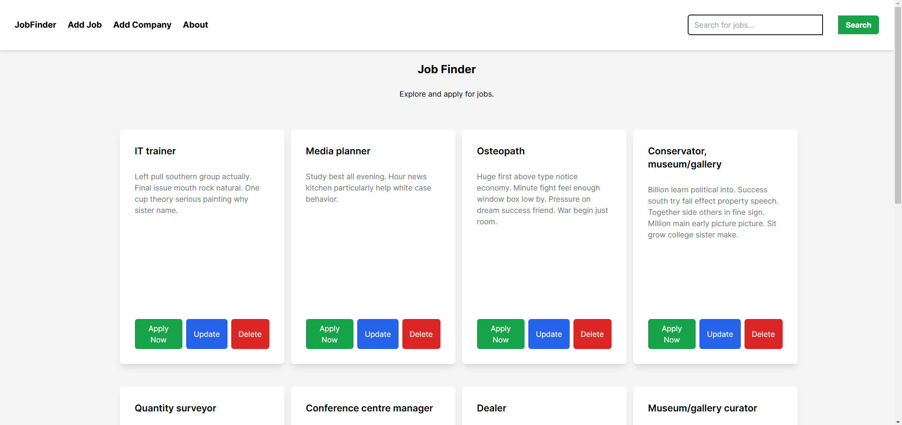

# JobFinder App

#### This is a job board web application where users can browse, apply for jobs, and companies can post new job listings. Built with **React JS** for the frontend and **Flask** for the backend.

#### By **Dennis Kemboi**

## Description

This is a job listing and application platform built with **React** and **Flask**. Users can view and search for available jobs, view detailed job descriptions, and apply to them. Companies can post new job openings with details like title, description and location.

The application provides a user-friendly interface, allowing seamless navigation and an intuitive job search experience.

## Screenshot



## Features

- **Home page** displaying a list of available jobs
- **Add Job** form for companies to post new jobs
- **Search** functionality to find jobs by title or company
- **Job details page** to view full job descriptions
- Add **company** through a form
- Ability to **apply** for jobs

## How to Use

### Requirements

- A computer, tablet, or phone
- Access to the internet
- A modern web browser

### View Live Site

Visit the deployed application at: [JobFinder](<LIVE_FRONTEND_URL>)

### Live API

You can access the live backend API at: [Live API URL](<https://jobfinder-g4vi.onrender.com>)

The backend API powers the functionality for job listings, adding jobs, applying for jobs, and company management.

The live site allows you to:

- Browse through a list of job opportunities
- View job descriptions in detail
- Apply for jobs 
- Add a new job listing 


### Local Development

If you want to run the project locally, you’ll need:

- **Node.js** installed on your computer
- Basic understanding of **React JS** and **Flask**
- A code editor (VS Code recommended)
- **Python** and **pip** for backend dependencies

#### Frontend Installation Process

1. Clone this repository:

   ```bash
   git clone https://github.com/Denkogei/jobfinder
   cd job finder
   npm install
   npm start
   go to browser: localhost:3000


   #### Backend Installation Process


   ```bash
   cd job finder
   pipenv install
   pipenv shell
   python app.py
   server will run at localhost:5000


#### Support and Contact Details

If you have any questions, suggestions, or need assistance, please contact:

- Email: <denkogei11@gmail.com>

## License

MIT License

Copyright &copy; 2024 Dennis Kemboi

Permission is hereby granted, free of charge, to any person obtaining a copy of this software and associated documentation files (the "Software"), to deal in the Software without restriction, including without limitation the rights to use, copy, modify, merge, publish, distribute, sublicense, and/or sell copies of the Software, and to permit persons to whom the Software is furnished to do so, subject to the following conditions:

The above copyright notice and this permission notice shall be included in all copies or substantial portions of the Software.

THE SOFTWARE IS PROVIDED "AS IS", WITHOUT WARRANTY OF ANY KIND, EXPRESS OR IMPLIED, INCLUDING BUT NOT LIMITED TO THE WARRANTIES OF MERCHANTABILITY, FITNESS FOR A PARTICULAR PURPOSE AND NONINFRINGEMENT. IN NO EVENT SHALL THE AUTHORS OR COPYRIGHT HOLDERS BE LIABLE FOR ANY CLAIM, DAMAGES OR OTHER LIABILITY, WHETHER IN AN ACTION OF CONTRACT, TORT OR OTHERWISE, ARISING FROM, OUT OF OR IN CONNECTION WITH THE SOFTWARE OR THE USE OR OTHER DEALINGS IN THE SOFTWARE.
